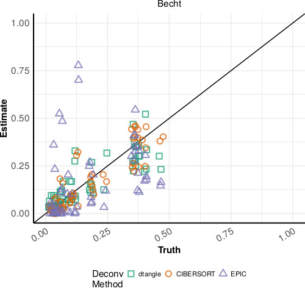

## dtangle: a method for cell-type deconvolution

**dtangle** is an R package for cell type deconvolution.

* The **R package** is available on [CRAN](https://cran.r-project.org/package=dtangle), on github, or from my box: [package](https://wm1693.box.com/s/5chpeh1j1zll6v2h56g6g8jk7j51iwr5) ([source](https://wm1693.box.com/s/csb3xewvlldw1lweb843m85i6d7tda53)).

## The Role of Scale in the Estimation of Cell-type Proportions (Pre-print)

* Our **new pre-print** on the role of scale in cell-type deconvolution is accessible [here](https://www.biorxiv.org/content/10.1101/857805v1)

* Our **docker image** for reproducing the analysis in paper can be found [here](https://hub.docker.com/r/gjhunt/hybriddeconv).

* The scripts for the analysis the manuscript can be found [here]()

## Bioinformatics Paper (2019)

* Our **publication** in Bioinformatics is accessible [here](https://academic.oup.com/bioinformatics/advance-article/doi/10.1093/bioinformatics/bty926/5165376?guestAccessKey=ac40b15d-bec0-48c1-be94-fbef567f63ec).

* Our **docker image** for reproducing the analysis in paper can be found [here](https://hub.docker.com/r/gjhunt/dtangle/).

* A package dtangle.data of **benchmark deconvolution data sets** can be found [here](https://wm1693.box.com/shared/static/4ntz9tggttvrn2nkw96ddpt6x4o79ksu.gz) ([source](https://wm1693.box.com/s/wjiiblczvo5p5wdt5siml8i6cff87ic3)).

* The scripts for the analysis in our bioinformatics paper can be found [here](https://wm1693.box.com/s/7u5mhph3io64dd8zrn4rdf9ce02368cu) or [here]()

## Vignettes

* Bulk RNA-seq and microarrays: [here](vign/basic-deconvolution.md) ([html](vign/basic-deconvolution.html) [rmd](https://github.com/gjhunt/dtangle/blob/master/vign/basic-deconvolution.Rmd))
* Using single-cell RNA-seq as references: [here](vign/sc_vignette.md) ([html](https://github.com/gjhunt/dtangle/blob/master/vign/sc_vignette.html) [rmd](https://github.com/gjhunt/dtangle/blob/master/vign/sc_vignette.Rmd))
* PBMC microarray deconvolution: [here](vign/blood.md) ([html](https://github.com/gjhunt/dtangle/blob/master/vign/blood.html) [rmd](https://github.com/gjhunt/dtangle/blob/master/vign/blood.Rmd))
