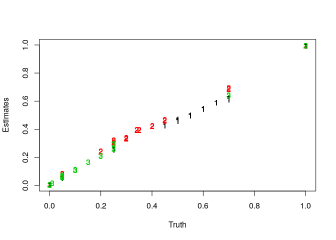

The Data
========

In this vignette we will work through a simple example of deconvolving cell type proportions from DNA microarray data. We work with a data set created from rats and introduced by [Shen-Orr et al](https://www.nature.com/nmeth/journal/v7/n4/abs/nmeth.1439.html). This is available on GEO with accession [GSE19830](https://www.ncbi.nlm.nih.gov/geo/query/acc.cgi?acc=GSE19830). The data set we will work with is subset of the Shen-Orr data and is included in the `dtangle` package under the name `shen_orr_ex`. Alternatively, we can access this and other data sets data set through the supplementary `dtangle.data` package we have made available [here](https://wm1693.box.com/s/np66a1wnhngafoawsiu665sjb7kye2ub). More information about the data set is available as part of the `R` help, `?shen_orr_ex`. First, load up the data set.

``` r
library('dtangle')
names(shen_orr_ex)
```

    ## [1] "data"       "annotation" "name"

In this data set rat brain, liver and lung cells have been mixed together in various proportions the resulting mixtures were analyzed with DNA microarrays. The mixing proportions are encoded in the mixture matrix

``` r
head(shen_orr_ex$annotation$mixture)
```

    ##           Liver Brain Lung
    ## GSM495209     1     0    0
    ## GSM495210     1     0    0
    ## GSM495211     1     0    0
    ## GSM495212     0     1    0
    ## GSM495213     0     1    0
    ## GSM495214     0     1    0

Each row of this matrix is a sample and each column gives the mixing proportions of the cell types in each sample.

The RMA-summarized gene expression data generated as part of the Shen-Orr experiment is accessible under `data$log`,

``` r
Y <- shen_orr_ex$data$log
Y[1:4,1:4]
```

    ##           X1367566_at X1367568_a_at X1367570_at X1367584_at
    ## GSM495209    3.396192      7.685769    5.722330    6.628653
    ## GSM495210    2.882626      7.759002    6.005583    6.771917
    ## GSM495211    3.072980      7.598871    5.741630    6.564820
    ## GSM495212    3.168440      7.209959    6.396841    7.040779

Each row is a different individual and each column is a particular gene. The values of the matrix are log<sub>2</sub> RMA-summarized gene expressions.

Arguments
=========

The arguments to dtangle can be grouped as follows. First are the the two most important groups of arguments:

1.  gene expression data input: Y, references, and pure\_samples
2.  marker gene controls: n\_markers, markers and marker\_method

and then the less important arguments for more fine-tuned control:

1.  data type fudge-factor controls: gamma and data\_type
2.  the summarizing function: summary\_fn

1. Y, references, and pure\_samples
===================================

In order to deconvolve gene expression data from mixture samples dtangle requires references of the cell-types to be deconvolved. The mixture gene expressions and reference gene expressions are given to dtangle using the arguments Y, references, and pure\_samples.

Here we use some data from [Shen-Orr et al](https://www.nature.com/nmeth/journal/v7/n4/abs/nmeth.1439.html) as an example. This data consists of log-scale expression measurements from mixtures of rat brain, liver and lung cells.

``` r
library('dtangle')
data = shen_orr_ex$data$log
mixture_proportions = shen_orr_ex$annotation$mixture
```

the true mixing proportion of each sample captured in the variable mixture\_proportions:

``` r
mixture_proportions
```

    ##           Liver Brain Lung
    ## GSM495209  1.00  0.00 0.00
    ## GSM495210  1.00  0.00 0.00
    ## GSM495211  1.00  0.00 0.00
    ## GSM495212  0.00  1.00 0.00
    ## GSM495213  0.00  1.00 0.00
    ## GSM495214  0.00  1.00 0.00
    ## GSM495215  0.00  0.00 1.00
    ## GSM495216  0.00  0.00 1.00
    ## GSM495217  0.00  0.00 1.00
    ## GSM495218  0.05  0.25 0.70
    ## GSM495219  0.05  0.25 0.70
    ## GSM495220  0.05  0.25 0.70
    ## GSM495221  0.70  0.05 0.25
    ## GSM495222  0.70  0.05 0.25
    ## GSM495223  0.70  0.05 0.25
    ## GSM495224  0.25  0.70 0.05
    ## GSM495225  0.25  0.70 0.05
    ## GSM495226  0.25  0.70 0.05
    ## GSM495227  0.70  0.25 0.05
    ## GSM495228  0.70  0.25 0.05
    ## GSM495229  0.70  0.25 0.05
    ## GSM495230  0.45  0.45 0.10
    ## GSM495231  0.45  0.45 0.10
    ## GSM495232  0.45  0.45 0.10
    ## GSM495233  0.55  0.20 0.25
    ## GSM495234  0.55  0.20 0.25
    ## GSM495235  0.55  0.20 0.25
    ## GSM495236  0.50  0.30 0.20
    ## GSM495237  0.50  0.30 0.20
    ## GSM495238  0.50  0.30 0.20
    ## GSM495239  0.55  0.30 0.15
    ## GSM495240  0.55  0.30 0.15
    ## GSM495241  0.55  0.30 0.15
    ## GSM495242  0.50  0.40 0.10
    ## GSM495243  0.50  0.40 0.10
    ## GSM495244  0.50  0.40 0.10
    ## GSM495245  0.60  0.35 0.05
    ## GSM495246  0.60  0.35 0.05
    ## GSM495247  0.60  0.35 0.05
    ## GSM495248  0.65  0.34 0.01
    ## GSM495249  0.65  0.34 0.01
    ## GSM495250  0.65  0.34 0.01

we can see from this that the first nine samples are pure reference samples of the three cell types and the remaining samples are mixture samples of the cell types. We want to use these reference samples to deconvolve the remaining mixture samples. This can be done in a couple of ways:

1.  We can provide Y and pure\_samples to dtangle. Here Y will be the combined matrix of reference and mixture samples and pure\_samples will tell dtangle which samples (rows of Y) are reference samples and (by elimination) which samples are mixture samples we wish to deconvolve.

``` r
pure_samples = list(Liver=c(1,2,3),Brain=c(4,5,6),Lung=c(7,8,9))

dt_out = dtangle(Y=data, pure_samples = pure_samples)

matplot(mixture_proportions,dt_out$estimates, xlim = c(0,1),ylim=c(0,1),xlab="Truth",ylab="Estimates")
```



1.  We can instead split the data into Y as just the matrix of mixture samples and references as the matrix of reference expressions.

``` r
mixture_samples = data[-(1:9),]
reference_samples = data[1:9,]

dt_out = dtangle(Y=mixture_samples, reference=reference_samples,pure_samples = pure_samples)

mixture_mixture_proportions = mixture_proportions[-(1:9),]
matplot(mixture_mixture_proportions,dt_out$estimates, xlim = c(0,1),ylim=c(0,1),xlab="Truth",ylab="Estimates")
```


Now the variable pure\_samples tells dtangle what cell type each of the the rows of the references matrix corresponds to. Notice that dtangle only estimates the mixing proportions for the samples given in the Y argument and so since we have removed the references samples from the matrix passed to Y then we only estimate the mixing proportions for the remaining 33 mixture samples. Previously we had estimated proportions for both the mixture and reference samples.

In this example we still needed the variable pure\_samples because our reference expression matrix contained multiple reference profiles for each cell type. Often one only has a reference expression matrix with one (typically average) expression profile per cell type. In this case we don't need the pure\_samples argument:

``` r
ref_reduced = t(sapply(pure_samples,function(x)colMeans(reference_samples[x,,drop=FALSE])))

dt_out = dtangle(Y=mixture_samples, reference=ref_reduced)

matplot(mixture_mixture_proportions,dt_out$estimates, xlim = c(0,1),ylim=c(0,1),xlab="Truth",ylab="Estimates")
```


2. n\_markers, markers and marker\_method
=========================================

Central to dtangle is finding marker genes for each cell type. Markers may either be given explicitly to dtangle by the user or they may be left up to dtangle itself to determine the marker genes automatically.

Letting dtangle determine the marker genes.
-------------------------------------------

If we do not specify the argument markers then dtangle automatically determines marker genes:

``` r
dt_out = dtangle(Y=mixture_samples, references = ref_reduced)
```

we can change the way that dtangle finds marker genes using the marker\_method argument:

``` r
dt_out = dtangle(Y=mixture_samples, references = ref_reduced,marker_method = "diff")
```

the default is to use "ratio".

The argument n\_markers specifies how many marker genes to use. If unspecified then dtangle uses the top 10% of genes (as ranked according to marker\_method) as markers.

``` r
dt_out$n_markers
```

    ## Liver Brain  Lung 
    ##    20    20    20

The number of marker genes can be explicitly specified by setting n\_markers:

``` r
dt_out = dtangle(Y=mixture_samples, references = ref_reduced,marker_method = "diff",n_markers=100)

dt_out$n_markers
```

    ## [1] 100 100 100

if just a single integer is specified then all genes us that number of marker genes. Alternatively we can specify a vector of integers to specify a number of marker genes individually for each cell type:

``` r
dt_out = dtangle(Y=mixture_samples, references = ref_reduced,marker_method = "diff",n_markers=c(100,150,50))

dt_out$n_markers
```

    ## [1] 100 150  50

we can also, in a similar fashion, pass a percentage (or vector of percentages) to n\_markers which will then use that percentage of the ranked marker genes for each cell type:

``` r
dt_out = dtangle(Y=mixture_samples, references = ref_reduced,marker_method = "diff",n_markers=.075)

dt_out$n_markers
```

    ## [1] 15 15 15

``` r
dt_out = dtangle(Y=mixture_samples, references = ref_reduced,marker_method = "diff",n_markers=c(.1,.15,.05))

dt_out$n_markers
```

    ## [1] 20 30 10

Specifying the marker genes explicitly.
---------------------------------------

Instead of letting dtangle determine the marker genes we can instead explicitly pass a list of markers to dtangle specifying the marker genes,

``` r
marker_genes = list(c(120,253,316),
                    c(180,429,14),
                    c(1,109,206))

dt_out = dtangle(Y=mixture_samples, references = ref_reduced,markers=marker_genes)
dt_out$n_markers
```

    ## [1] 3 3 3

the format of the list is precisely the same format as returned in the markers element of the output of dtangle, that is, a list of vectors of column indicies of *Y* that are markers of each of the cell types. The elements of the list correspond one to each cell type in the same order specified either in elements of pure\_samples or by the rows of references. The argument of n\_markers can be used in the same way to subset the markers if desired.

How dtangle finds markers
-------------------------

dtangle finds the marker genes by using the find\_markers function.

``` r
mrkrs = find_markers(Y=mixture_samples, references = ref_reduced)
names(mrkrs)
```

    ## [1] "L"  "V"  "M"  "sM"

which returns a list with four elements L which contains all genes putatively assigned to a cell type they mark, V which contains the ranking values by which the elements of L are ordered, M and sM which are the matrix and sorted matrix used to create V and L.

We can pass either the entire list or just the L list to dtangle as markers and re-create how dtangle automatically chooses markers:

``` r
dt_out = dtangle(Y = mixture_samples,references = ref_reduced,markers=mrkrs,n_markers=.1)
```

3. gamma and data\_type
=======================

A unique aspect of dtangle is its parameter *γ*. This is a fudge factor dtangle applies to account for imperfect mRNA quantification, especially for microarrays. The value of *γ* can be specified through the argument gamma or data\_type.

We can explicitly set gamma if we want,

``` r
dt_out = dtangle(Y = mixture_samples,references = ref_reduced,gamma=.9)
```

or we can set it a pre-defined value by passing the data\_type argument which sets *γ* automatically based upon the data type:

``` r
dt_out = dtangle(Y = mixture_samples,references = ref_reduced,data_type="microarray-gene")
```

the options for *γ* are

``` r
dtangle:::gma
```

    ## $ma_probe
    ## [1] 0.4522564
    ## 
    ## $ma_gene
    ## [1] 0.6999978
    ## 
    ## $rna_seq
    ## [1] 0.9433902

if neither gamma nor data\_type are specified then dtangle sets *γ* to one. If there is no intuition about either the data type or a good value of *γ* then we recommend leaving *γ* at one.

4. summary\_fn
==============

There is a final optional parameter summary\_fn which controls how dtangle aggregates the gene expressions for estimation. dtangle is a very robust algorithm and so the default summary function is the mean. One can specify the median as a more robust option, or any other summary statistic if so they desire. We recommend either the mean or the median.

``` r
dt_out = dtangle(Y = mixture_samples,references = ref_reduced,summary_fn=median)
head(dt_out$estimates)
```

    ##                Liver      Brain      Lung
    ## GSM495218 0.05229139 0.29300675 0.6547019
    ## GSM495219 0.05505613 0.29357471 0.6513692
    ## GSM495220 0.05398451 0.29489946 0.6511160
    ## GSM495221 0.63900638 0.08046716 0.2805265
    ## GSM495222 0.63311391 0.08094852 0.2859376
    ## GSM495223 0.64332527 0.07615796 0.2805168

``` r
dt_out = dtangle(Y = mixture_samples,references = ref_reduced,summary_fn=mean)
head(dt_out$estimates)
```

    ##                Liver      Brain      Lung
    ## GSM495218 0.04807655 0.30980298 0.6421205
    ## GSM495219 0.05213084 0.30896051 0.6389086
    ## GSM495220 0.05029034 0.30536233 0.6443473
    ## GSM495221 0.62007321 0.08564296 0.2942838
    ## GSM495222 0.61651390 0.08539553 0.2980906
    ## GSM495223 0.62319525 0.08137003 0.2954347
