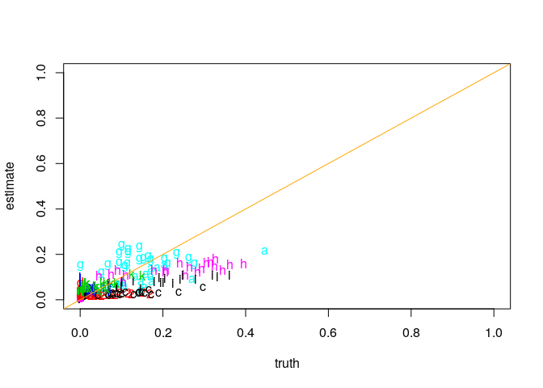
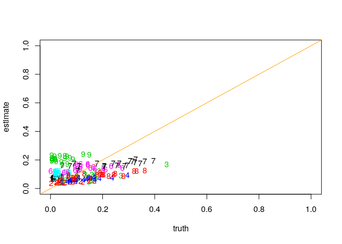

There is a good reference for PBMCs from a 2015 paper by Newman et al. They call the reference LM22. You can access this data as part of the dtangle.data package available through our webpage: <http://dtangle.github.io>

First we load the packages

``` r
library('dtangle')
library('dtangle.data')
library('limma')
```

then we can load the Newman PBMC data set

``` r
dset = newman_pbmc
```

then load gene expressions (data) and mixture proportions (mix)

``` r
data = dset$data$log
data[1:5,1:5]
```

    ##         ABCB4 ABCB9 ACAP1 ACHE ACP5
    ## X17.002  4.61  4.50  7.04 4.51 4.54
    ## X17.006  4.92  4.85  7.26 4.59 5.87
    ## X17.019  4.98  4.89  7.74 4.69 5.22
    ## X17.023  4.75  4.88  7.01 4.64 4.66
    ## X17.026  4.40  4.48  7.21 4.40 4.80

``` r
mix = dset$annotation$mixture
mix[1:5,1:5]
```

    ##         B.cells.naive B.cells.memory T.cells.CD8 T.cells.CD4.naive
    ## X17.002    0.12360000     0.02960000  0.22360000        0.10960000
    ## X17.006    0.03329667     0.01829817  0.32046795        0.32566743
    ## X17.019    0.15091509     0.04070407  0.17861786        0.04530453
    ## X17.023    0.16768323     0.02949705  0.08689131        0.07529247
    ## X17.026    0.08400840     0.04690469  0.27982798        0.08980898
    ##         T.cells.CD4.memory.resting
    ## X17.002                 0.09430000
    ## X17.006                 0.11668833
    ## X17.019                 0.06630663
    ## X17.023                 0.27537246
    ## X17.026                 0.21172117

the first 20 rows of data are gene exprs from heterogeneous mixtures to be deconvolved. The remaining rows are references for each of several PBMC cell types (B, NK, T, etc). Because there are so many cell types we collapse some of the sub-types into a fewer number of general leukocyte types:

``` r
general_types = factor(sapply(strsplit(colnames(mix)," "),"[",1))
mix = sapply(levels(general_types),function(g)rowSums(mix[,general_types==g,drop=FALSE]))
```

We can extract out which rows are pure reference samples:

``` r
pure_samples = lapply(1:ncol(mix),function(i)which(mix[,i]==1))
names(pure_samples) = colnames(mix)
lapply(pure_samples,head,n=2)
```

    ## $B.cells.memory
    ## B cells memory 
    ##             21 
    ## 
    ## $B.cells.naive
    ## B cells naive 
    ##            22 
    ## 
    ## $Dendritic.cells.activated
    ## Dendritic cells activated 
    ##                        23 
    ## 
    ## $Dendritic.cells.resting
    ## Dendritic cells resting 
    ##                      24 
    ## 
    ## $Eosinophils
    ## Eosinophils 
    ##          25 
    ## 
    ## $Macrophages.M0
    ## Macrophages M0 
    ##             26 
    ## 
    ## $Macrophages.M1
    ## Macrophages M1 
    ##             27 
    ## 
    ## $Macrophages.M2
    ## Macrophages M2 
    ##             28 
    ## 
    ## $Mast.cells.activated
    ## Mast cells activated 
    ##                   29 
    ## 
    ## $Mast.cells.resting
    ## Mast cells resting 
    ##                 30 
    ## 
    ## $Monocytes
    ## Monocytes 
    ##        31 
    ## 
    ## $Neutrophils
    ## Neutrophils 
    ##          32 
    ## 
    ## $NK.cells.activated
    ## NK cells activated 
    ##                 33 
    ## 
    ## $NK.cells.resting
    ## NK cells resting 
    ##               34 
    ## 
    ## $Plasma.cells
    ## Plasma cells 
    ##           35 
    ## 
    ## $T.cells.CD4.memory.activated
    ## T cells CD4 memory activated 
    ##                           36 
    ## 
    ## $T.cells.CD4.memory.resting
    ## T cells CD4 memory resting 
    ##                         37 
    ## 
    ## $T.cells.CD4.naive
    ## T cells CD4 naive 
    ##                38 
    ## 
    ## $T.cells.CD8
    ## T cells CD8 
    ##          39 
    ## 
    ## $T.cells.follicular.helper
    ## T cells follicular helper 
    ##                        40 
    ## 
    ## $T.cells.gamma.delta
    ## T cells gamma delta 
    ##                  41 
    ## 
    ## $T.cells.regulatory..Tregs.
    ## T cells regulatory (Tregs) 
    ##                         42

and use those to deconvolve the other samples

``` r
dt = dtangle(Y=data,pure_samples=pure_samples,n_markers=.9,data_type='microarray-gene')
matplot(mix[-unlist(pure_samples),],dt$estimates[-unlist(pure_samples),],xlab="truth",ylab="estimate",
        ylim=c(0,1),xlim=c(0,1));abline(coef=c(0,1),col='orange')
```



Since the cell types in the mixtures are known in this case we can subset the cell types to only look for to those cell types that we know exist in the data. First we determine what cell types are present and subset the data appropriately,

``` r
known_types = colnames(mix)[colSums(mix[1:20,])>0]
known_types
```

    ## [1] "B.cells.memory"               "B.cells.naive"               
    ## [3] "Monocytes"                    "NK.cells.activated"          
    ## [5] "T.cells.CD4.memory.activated" "T.cells.CD4.memory.resting"  
    ## [7] "T.cells.CD4.naive"            "T.cells.CD8"                 
    ## [9] "T.cells.gamma.delta"

``` r
keep_rows = c(1:20,unlist(pure_samples[known_types]))
data = data[keep_rows,]
mix = mix[keep_rows,known_types]
pure_samples = lapply(1:ncol(mix),function(i)which(mix[,i]==1))
names(pure_samples) = colnames(mix)
```

and then run dtangle on the subsetted data

``` r
dt = dtangle(Y=data,pure_samples=pure_samples,n_markers = .9,data_type='microarray-gene')
matplot(mix[-unlist(pure_samples),],dt$estimates[-unlist(pure_samples),],xlab="truth",ylab="estimate",
        ylim=c(0,1),xlim=c(0,1));abline(coef=c(0,1),col='orange')
```


