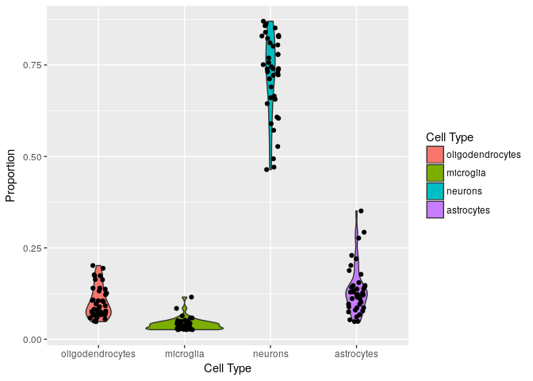

In this vignette we will work through an example of deconvolving brain cell type proportions from DNA microarray data. We work with a dataset created from post-mortem human brains and introduced by Lu et al. This is available on GEO with accession GSE53890. We will refer to this dataset as the mixture dataset. The reference data set we will work with is subset of the Darmanis et al single cell brain data. This data is currently available at <https://umich.app.box.com/v/dtanglescdata>. The GEO accession number for this dataset is GSE67835. First load up the datasets.

``` r
library(GEOquery)
library(dtangle)

gse53890 <- getGEO('GSE53890', GSEMatrix= TRUE)
me <- as.matrix(exprs(gse53890[[1]]))

load("NormalizedData_GSE67835.RData")
load("Anno_GSE67835.RData")
```

Unfortunately, the two datasets use different gene identifiers. We will have to convert the gene identifiers in the mixture dataset to match those in the reference dataset.

``` r
library(hgu133plus2.db)
library(AnnotationDbi)

k <- keys(hgu133plus2.db, keytype="PROBEID")
gene_anno <- mapIds(hgu133plus2.db, keys = k, column = c("SYMBOL"), keytype="PROBEID")
index <- pmatch(rownames(me), names(gene_anno))

rownames(me) <- gene_anno[index]
```

In the next step, we normalize the mixture datasets using simple background correction. Normally, we would also need to convert the expression in the single cell reference dataset to log cpms. However, this is already done in this case. If this is not the case in your dataset it can be done using the `edgeR::cpm` function (make sure to add a prior count). Normalization will allow us to combine the count data from the scRNA-seq and expression measurements from the microarrays.

``` r
library(limma)

me <- backgroundCorrect(me, method='normexp')
```

    ## Array 1 corrected
    ## Array 2 corrected
    ## Array 3 corrected
    ## Array 4 corrected
    ## Array 5 corrected
    ## Array 6 corrected
    ## Array 7 corrected
    ## Array 8 corrected
    ## Array 9 corrected
    ## Array 10 corrected
    ## Array 11 corrected
    ## Array 12 corrected
    ## Array 13 corrected
    ## Array 14 corrected
    ## Array 15 corrected
    ## Array 16 corrected
    ## Array 17 corrected
    ## Array 18 corrected
    ## Array 19 corrected
    ## Array 20 corrected
    ## Array 21 corrected
    ## Array 22 corrected
    ## Array 23 corrected
    ## Array 24 corrected
    ## Array 25 corrected
    ## Array 26 corrected
    ## Array 27 corrected
    ## Array 28 corrected
    ## Array 29 corrected
    ## Array 30 corrected
    ## Array 31 corrected
    ## Array 32 corrected
    ## Array 33 corrected
    ## Array 34 corrected
    ## Array 35 corrected
    ## Array 36 corrected
    ## Array 37 corrected
    ## Array 38 corrected
    ## Array 39 corrected
    ## Array 40 corrected
    ## Array 41 corrected

Next, we need to find the genes that are common to both datasets and join the datasets using these. After combining the datasets, we will apply quantile normalization to these datasets in order to ensure that they are indeed comparable.

``` r
commongenes <- intersect (rownames(me), rownames(sce))

me <- me[pmatch(commongenes, rownames(me)), ]
sce <- sce[pmatch(commongenes, rownames(sce)), ]

y <- cbind(sce, me)
y <- normalizeBetweenArrays(y)
y <- t(y)
```

In order to apply dtangle, we need to create an object that records can the pure samples of each cell type.

``` r
all_cell_type <- unique(anno$CellType)

pure_samples <- lapply(1:length(all_cell_type), function(i) {
    which(anno$CellType == all_cell_type[i])
})

names(pure_samples) = all_cell_type
```

We are finally ready to apply dtangle. The first step in running dtangle is to identify marker genes for each cell type. These may be provided by the scientist if they are already known or may be determined by dtangle or another algorithm. To find marker genes using dtangle we pass the following arguments to the `find_markers` function:

1.  the data matrix, `Y`,

2.  the list of pure samples for each type, `pure_samples`,

3.  the data type, `data_type`,

4.  the method used to rank markers, `marker_method`.

After we have ranked our markers with find\_markers we need to determine how many markers to use for each cell type. The simplest way to do this is to choose, say, the top 10% of all marker genes for each type.

``` r
marker_list = find_markers(y,pure_samples=pure_samples,data_type="rna-seq",marker_method='ratio')

q = .1
quantiles = lapply(marker_list$V,function(x)quantile(x,1-q))
K = length(pure_samples)
n_markers = sapply(1:K,function(i){max(which(marker_list$V[[i]] > quantiles[[i]]))})
n_markers
```

    ## [1] 275 261 392 325

Now that we have ranked the genes as markers for each type and chosen how many marker genes to use for each cell type we can run the dtangle deconvolution algorithm. providing to the dtangle function the arguments:

1.  `Y`, our data matrix

2.  the list of `pure_samples`

3.  the number of markers to use for each cell type, `n_markers`

4.  the data\_type

5.  the list of ranked markers (output from `find_markers`) to the markers argument.

``` r
marks = marker_list$L
dc <- dtangle(y, pure_samples=pure_samples, n_markers=n_markers, data_type = 'microarray-gene', markers = marks)
```

Finally, we can extract the proportion estimates for our mixture dataset.

``` r
final_est <- dc$estimates[(dim(sce)[2]+1):dim(y)[1],]
colnames(final_est) <-  all_cell_type

head(final_est)
```

    ##            oligodendrocytes  microglia   neurons astrocytes
    ## GSM1303144       0.04982785 0.02725588 0.8697770 0.05313925
    ## GSM1303145       0.04946921 0.02623444 0.8630468 0.06124953
    ## GSM1303146       0.05543027 0.02787169 0.8308176 0.08588047
    ## GSM1303147       0.07456747 0.03862733 0.7401753 0.14662994
    ## GSM1303148       0.09184138 0.04280820 0.7692850 0.09606539
    ## GSM1303149       0.04825578 0.02719847 0.8285277 0.09601801

We can now plot the proportion estimates.

``` r
library(ggplot2)
library(reshape2)

plot_data <- melt(final_est)
colnames(plot_data) <- c("Sample", "Cell Type", "Proportion") 

plot_data$Proportion <- as.numeric(plot_data$Proportion)

ggplot(plot_data, aes(x = `Cell Type`, y=Proportion))+geom_violin(aes(fill = `Cell Type`)) + geom_jitter(height = 0, width = 0.1)
```


